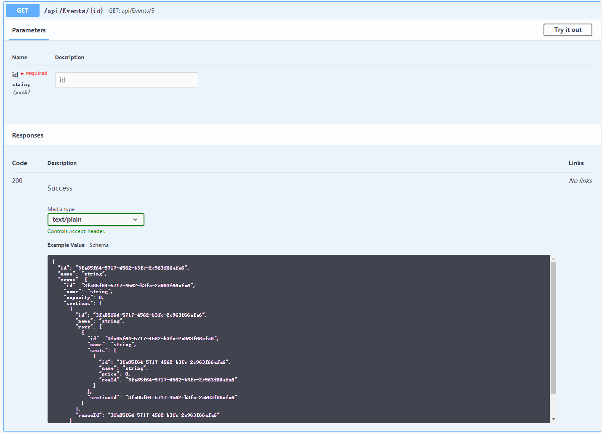

# Ticketing API

This API is built for finding and purchasing seats in a venue. 

## Categories

For this section, we have different events for this API.

* Events
* EventSeats
* Rows
* Seats
* Sections
* TicketPurchases
* TicketPurchaseSeats
* Venues

## Functions 

For each of the categories, we have five distinct functions.

* GET: returns the information of the event via search by text
    

* POST: adds the user insertion of event to the database
    

* getID: returns the information of the event via search by ID
    

* PUT: adds the user insertion of event to the database via ID
    

* DELETE: removes the event
    

## Business Logic

Like a normal ticketing API, we have basic functions such as get through search, post, and delete.
However, we added two more functions that were deemed necessary: PUT and GETID. These two are basically search by ID, and insert by ID. By implementing these two functions, it eased communication via different ticket holders, as well as the process of ticket transfer and resell.

## Authors

* **Kaiyuan Li** - (https://github.com/lm902) Main
* **James Ding** - (https://github.com/dingjamma) 

## License

This project is licensed under China's corona incorporation. 

## Acknowledgments

* Hat tip 
* Inspiration
* T2 Head

